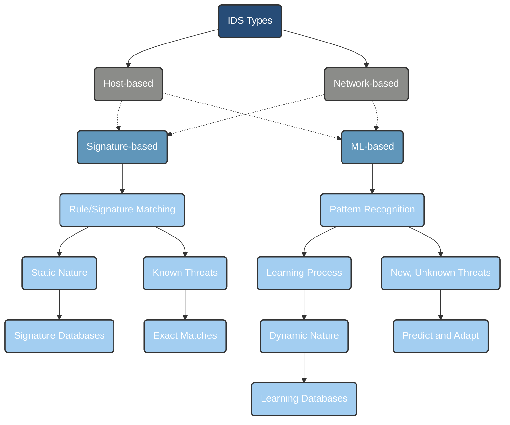

# Diagram of IDS Types

```mermaid
graph TD
    IDS("IDS Types")
    HostBased("Host-based")
    NetworkBased("Network-based")
    SignatureBased("Signature-based")
    MLBased("ML-based")
    RuleMatching("Rule/Signature Matching")
    StaticNature("Static Nature")
    SignatureDatabases("Signature Databases")
    KnownThreats("Known Threats")
    ExactMatches("Exact Matches")
    PatternRecognition("Pattern Recognition")
    LearningProcess("Learning Process")
    DynamicNature("Dynamic Nature")
    LearningDatabases("Learning Databases")
    NewThreats("New, Unknown Threats")
    PredictAdapt("Predict and Adapt")

    IDS --> HostBased
    IDS --> NetworkBased
    HostBased -.-> SignatureBased
    NetworkBased -.-> SignatureBased
    HostBased -.-> MLBased
    NetworkBased -.-> MLBased
    SignatureBased --> RuleMatching
    RuleMatching --> StaticNature --> SignatureDatabases
    RuleMatching --> KnownThreats --> ExactMatches
    MLBased --> PatternRecognition
    PatternRecognition --> LearningProcess --> DynamicNature --> LearningDatabases
    PatternRecognition --> NewThreats --> PredictAdapt

    classDef ids fill:#274C77,stroke:#333,stroke-width:2px,text:#333, color:#fff;
    classDef shared fill:#6096BA,stroke:#333,stroke-width:2px, color:#fff;
    classDef lower fill:#A3CEF1,stroke:#333,stroke-width:2px, color:#fff;
    classDef smallest fill:#8B8C89,stroke:#333,stroke-width:2px, color:#fff;
    class IDS ids;
    class HostBased,NetworkBased smallest;
    class SignatureBased,MLBased shared;
    class RuleMatching,StaticNature,SignatureDatabases,KnownThreats,ExactMatches,PatternRecognition,LearningProcess,DynamicNature,LearningDatabases,NewThreats,PredictAdapt lower;
```